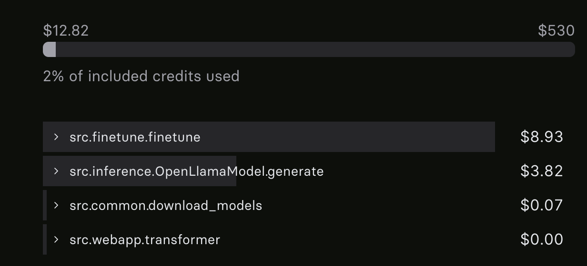
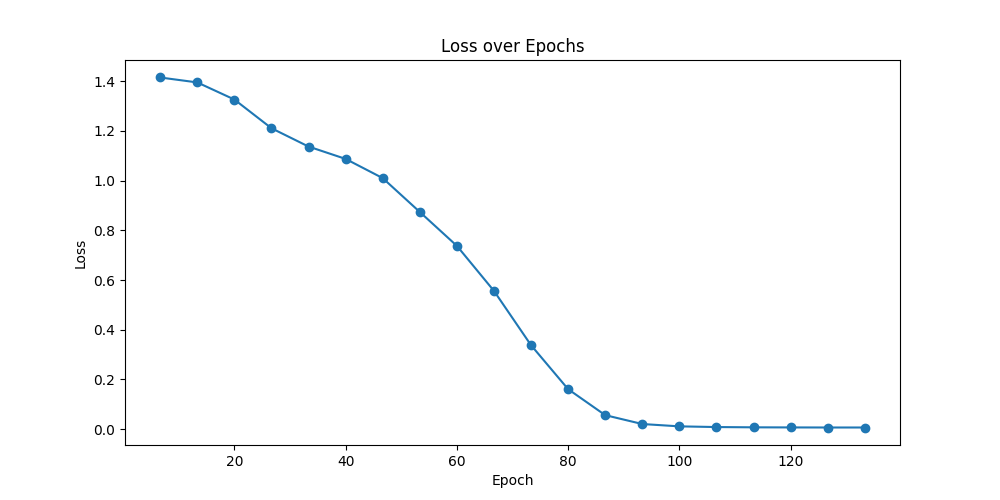
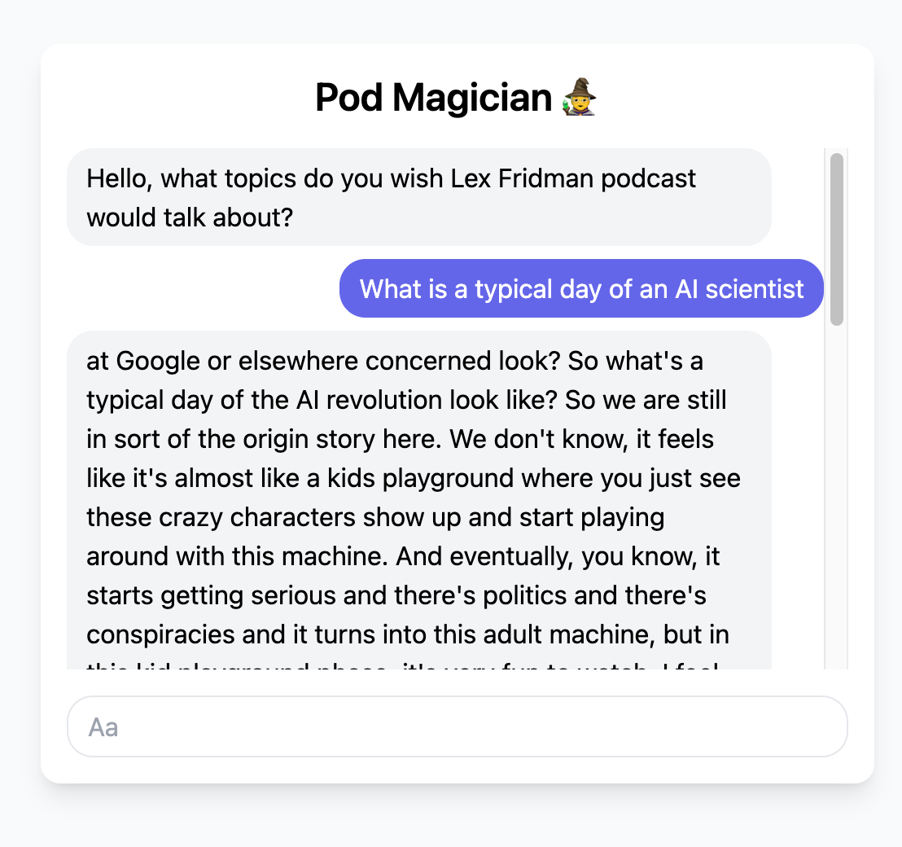

# Pod Magician 🧙

> hallucination is a ~~bug~~ feature

[Try it online](https://xg-wang--pod-magician-transformer.modal.run/). Sorry it cloud be slow, still hackathon quality 🙂.

## Why?

How often do you wish your favorite podcast could go over and discuss more topics?

## How it works

### Overview

1. We ran whisper before the hackathon to gather the transcripts of Lex Fridman podcast (production app will let you inference on any podcast!).
2. We finetune the transcripts dataset.
3. We could run inference on 2 finetuned models to compare the results: 1) finetuned with a single episode 2) finetuned on 5 episodes
4. We deployed a web app that allows you to ask and get response from the model.

### Cost

We spent ~$13 during the hackathon

### Dataset

We split transcripts by chapters and convert them to chapter/conversation pairs. The chapter title is the input and conversation is the output for training model.

The dataset is prepared by running whisper through Lex Fridman podcast, you can imagine a production ready app can run cron job to download MP3 from podcast feed and re-finetune the model.

### Finetune

Finetuning is performed on [OpenLLaMA](https://github.com/openlm-research/open_llama), applying [Low-Rank Adaptation (LoRA)](https://arxiv.org/abs/2106.09685), a [parameter-efficient fine-tuning technique](https://huggingface.co/blog/peft). We ran the training on A100 via [Modal](https://www.modal.com)

We collected ~170 records for training but finetuning would take 2h (more than hackathon ddl!), so we trained on 100 records.

## Demo!

### Web app

### What is the meaning of life

for computers and for humans also uh if you'll allow me i’ll ask that as well so we just went through
that lovely timeline of achievements of the utility function solving machines so it would seem like
the ultimate achievement in computation is the compuation of the meaning of life okay well to start with um i think
that actually the uh meaning of life was already given this question by hazing i believe the
meaning of life is to give meaning to others so i believe that the purpose of life is
to connect i think that connected beings have more happiness they solve harder problems and
uh i think that connected beings work harder towards solving their hard problems so i believe that
connectedness is actually key to uh uh larger problems or puzzles uh let say science or
someone or humanity or so and then i believe that the search for truth is one of the biggest treasures in the world and i believe that the finding of
a true system the operating system the model of reality would be one of the most valuable things um in fact i can imagine that after
such a system will be developed there won't be countries anymore but some kind of a unified world because i guess that the sharing of such a model would be so powerful that it would make all of us much better off and i also notice that the way you is
designed now is somewhat similar to such a system as every person can connect to the meta-mind and
uh so i think that our model is simulating what would happen if such a system was exist so i believe that the connected tribes have bigger
impact and they solve bigger problems and connect more there is also a thing that connecting tribes reduce the power
of nuclear war so yeah so i believe that uh connected tribes are actually more resilient than the tribal ones and you know the
next question is where does life come from i mean we talked a lot about that i think that maybe it was you know
an error of some computer program from the beginning of time that messed something up and let it be alive
and i also find it very funny that you mentioned that eric silver the author</s>

### Balancing AI safety and exploiting capabilities

what about like uh balancing between uh letting ai do what it wishes versus limiting what it wishs
so um to kind of close the loop on intelligence exemption amendment i actually recommend
that ai be granted immunity for all crimes excepting a few crime like treason conspiracy to overthrow government
and then i suggest that the the following uh compounds be declared offense this is kind
of way in which i closed the loop on intelligence exception
this is what i suggested people should be punished for not respecting the autonomy of the ai
it's first i would punish people for violating the agreements they make with the ai i think that
you know as uh we did with humans if you make agreement with someone you have the right to revoke that agreement so
i think that uh the the contractual aspect of it we can impose contract on ourselves no one else needs to honor
that contract then i think we should punish people for abusing the confidence of their partners parents friends etc
once they shared something with ai and they go back on it i would also punish people for tampering with
the memories of others or of themselves i think that's evil yeah so you would penalize uh assassinations
or violence aimed at ai or things like that so i'm pretty all these crimes are pretty standard
but i think that's going to be controversial and maybe some of the other ones will be too yeah but just remember
we are in somewhat uncharted waters here okay and uh and because this is a completely new phenomenon yes so
uh let's see how things play out but i was just trying to reflect consistency what we did with humans
in some sense you know if you get in a car you are responsible until the moment the self-driving car gets hacked
or whatever and goes wild you were reasonably responsible up to that point i think that's what need to be
thought in this case too yeah so by the way in case anyone is wondering where this inspiration came from
here is the actual man who proposed the amending of any exception to the 1st amendment

### Finetune on only 1 episode is obviously worse

Input: What is the meaning of life

Response:

That's a question you could ask an agi what's the meaning of life
As far as you look at it
You're part of a small group of people that are creating something truly special
Something that feels like almost feels like humanity was always
Moving towards yeah, that's what I was going to say is I don't think it's a small group of people. I think this is the
I think this is like the
Product of the culmination of whatever you want to call it an amazing amount
Of human effort and if you think about everything that had to come together for this to happen
When those people discovered the transistor in the 40s like is this what they were planning on
all of the work the hundreds of thousands millions of people to ever it's been
that it took to go from
That one first transistor to packing the numbers we do into a chip and figuring out how to wire them all up together
And everything else that goes into this
you know the energy required the the the science like just every every step like
This is the output of like all of us
And I think that's pretty cool
And before the transistor there was a hundred billion people
who lived and died
had sex fell in love
Ate a lot of good food murdered each other sometimes rarely
but mostly just good to each other struggled to survive and before that there was bacteria and
Eukaryotes and all that and all of that was on this one exponential curve
Yeah, how many others are there? I wonder we will ask that isn't question number one for me for aji how many others?
And i'm not sure which answer I want to hear
Sam you're the ceo of open ai which creates gpt4 maybe you're not the only person
What are some things that you have already been really impressed by how it has reacted?
Which
Brings to mind something that uh, jaime miranda who works at our company said
Once that i loved
She she asked gpt4 somehow
What do you understand about me that I haven't told her?
And then it like answered something that</s>
